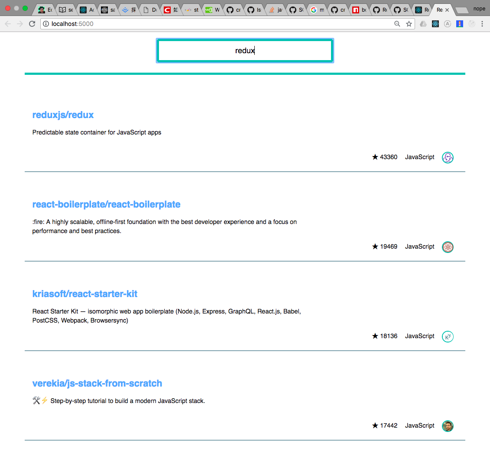

# Github Repo Search
DEMO: [http://purepennons.github.io/github-repo-search](http://purepennons.github.io/github-repo-search)

## Development
### Application
```shell
$ yarn && yarn start
```
Open [http://localhost:3000/](http://localhost:3000/).

### Component Preview
```shell
$ yarn styleguide
```
Open [http://localhost:6060/](http://localhost:6060/).

## Tech Stack
* Use 16.3 context api as a single source and inject with [react-context-api](https://github.com/purepennons/react-context-api).
* Use [styled-components](https://github.com/styled-components/styled-components) as CSS-in-JS solution.
* Bottom-up development with [styleguidist](https://github.com/styleguidist/react-styleguidist).
* Fetch with [apollo-link-rest](https://github.com/apollographql/apollo-link-rest).
* Rate-limit with [bottleneck](https://github.com/SGrondin/bottleneck/tree/version-1).
* Debounce with [lodash.debounce](https://lodash.com/docs/4.17.10#debounce).

## Preview
